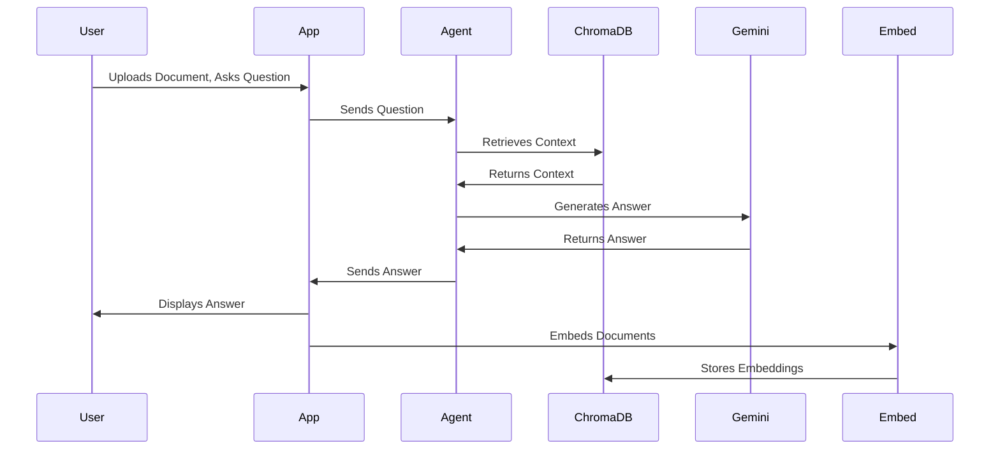

# LegalAI Architecture and Design

## Project Overview

The LegalAI project provides a Legal AI assistant capable of answering questions based on provided documents. It uses embeddings to find relevant context and a language model to generate answers. The system leverages Langchain and Google Gemini for its core functionality.

## Architecture

The LegalAI system consists of the following main components:

*   **Streamlit Application (app.py):** Provides the user interface for uploading documents and asking questions.
*   **Agent (agent.py):** Implements the agent logic for answering questions using Retrieval Augmented Generation (RAG).
*   **Embedding Module (embed.py):** Handles the embedding of documents into a vector store.
*   **Utilities (utils.py):** Defines constants and utility functions for file paths, URLs, and data handling.

    ```mermaid
      graph LR
        User["User Interface (Streamlit)"] -->|Uploads Documents, Asks Questions| App["app.py"]
        App -->|Sends Question| Agent["agent.py"]
        Agent -->|Retrieves Context| ChromaDB["ChromaDB Vector Store"]
        ChromaDB -->|Returns Context| Agent
        Agent -->|Generates Answer| Gemini["Google Gemini LLM"]
        Gemini -->|Returns Answer| App
        App -->|Displays Answer| User
        App -->|Embeds Documents| Embed["embed.py"]
        Embed -->|Stores Embeddings| ChromaDB
        Embed -->|Fetches Documents| Utils["utils.py"]
    ```

### Component Details

#### Streamlit Application (app.py)

The `app.py` file is the entry point for the LegalAI application. It uses the Streamlit library to create an interactive user interface.

*   **Functionality:**
    *   Initializes the chat interface.
    *   Handles user input (questions).
    *   Calls the `agent.py` module to generate answers.
    *   Displays the answers to the user.
    *   Manages chat history using Streamlit's session state.

#### Agent (agent.py)

The `agent.py` file implements the core logic for answering questions. It uses the Langchain library and Google Gemini to create a Retrieval Augmented Generation (RAG) chain.

*   **Functionality:**
    *   Initializes the Google Gemini LLM and embeddings.
    *   Connects to a ChromaDB vector store.
    *   Defines prompts for contextualizing questions and generating answers.
    *   Uses a history-aware retriever to incorporate chat history into the question answering process.
*   **Key Classes:**
    *   `NewsChat`: The main class that encapsulates the RAG chain logic.

#### Embedding Module (embed.py)

The `embed.py` file handles the embedding of documents into a ChromaDB vector store. It uses the Google Gemini embeddings to create vector representations of the text.

*   **Functionality:**
    *   Extracts text from PDFs using `PyMuPDF`.
    *   Splits text into smaller sections.
    *   Embeds the text sections using Google Gemini embeddings.
    *   Stores the embeddings in a ChromaDB vector store.

#### Utilities (utils.py)

The `utils.py` file defines constants for file paths and URLs, and includes functions for loading and saving article data.

*   **Functionality:**
    *   Defines constants for file paths and URLs.
    *   Provides functions for loading and saving article data to JSON files.

### Data Flow

The data flow within the LegalAI system can be summarized as follows:

1.  The user uploads documents and asks questions through the Streamlit application (`app.py`).
2.  The `app.py` module sends the user's question to the `agent.py` module.
3.  The `agent.py` module retrieves relevant context from the ChromaDB vector store.
4.  The ChromaDB vector store returns the context to the `agent.py` module.
5.  The `agent.py` module uses the Google Gemini LLM to generate an answer based on the retrieved context and the user's question.
6.  The Google Gemini LLM returns the answer to the `agent.py` module.
7.  The `agent.py` module sends the answer back to the `app.py` module.
8.  The `app.py` module displays the answer to the user.
9.  When a new document is uploaded, the `embed.py` module extracts the text from the document, splits it into smaller sections, and embeds the text sections using Google Gemini embeddings.
10. The `embed.py` module stores the embeddings in the ChromaDB vector store.



## Setup Instructions

1.  **Install the requirements:**

    ```bash
    pip install -r requirements.txt
    ```

2.  **Set the Google API Key:**

    ```bash
    export GOOGLE_API_KEY=<your_google_api_key>
    ```

    Replace `<your_google_api_key>` with your actual Google API key.

3.  **Run the application:**

    ```bash
    python app.py
    ```

## Design Principles

*   **Modularity:** The system is designed with modular components that can be easily replaced or updated.
*   **Scalability:** The system can be scaled to handle a large number of documents and users.
*   **Maintainability:** The system is designed to be easy to maintain and debug.
*   **Use of Established Libraries:** The system leverages established libraries such as Langchain, Streamlit, and ChromaDB to ensure stability and reliability.
