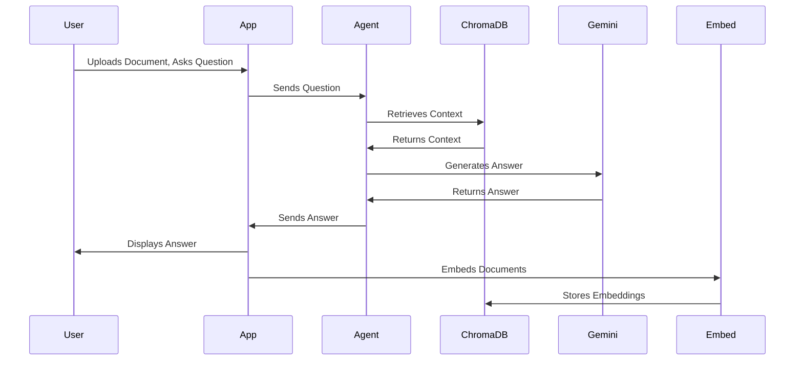

# LegalAI Architecture and Design

## Project Overview

The LegalAI project provides a Legal AI assistant capable of answering questions based on provided documents. It uses embeddings to find relevant context and a language model to generate answers. The system leverages Langchain and Google Gemini for its core functionality.

## Architecture

The LegalAI system consists of the following main components:

*   **Streamlit Application (app.py):** Provides the user interface for uploading documents and asking questions.
*   **Agent (agent.py):** Implements the agent logic for answering questions using Retrieval Augmented Generation (RAG).
*   **Embedding Module (embed.py):** Handles the embedding of documents into a vector store.
*   **Utilities (utils.py):** Defines constants and utility functions for file paths, URLs, and data handling.

    ```mermaid
      graph LR
        User["User Interface (Streamlit)"] -->|Uploads Documents, Asks Questions| App["app.py"]
        App -->|Sends Question| Agent["agent.py"]
        Agent -->|Retrieves Context| ChromaDB["ChromaDB Vector Store"]
        ChromaDB -->|Returns Context| Agent
        Agent -->|Generates Answer| Gemini["Google Gemini LLM"]
        Gemini -->|Returns Answer| App
        App -->|Displays Answer| User
        App -->|Embeds Documents| Embed["embed.py"]
        Embed -->|Stores Embeddings| ChromaDB
        Embed -->|Fetches Documents| Utils["utils.py"]
    ```

### Component Details

#### Streamlit Application (app.py)

The `app.py` file is the entry point for the LegalAI application. It uses the Streamlit library to create an interactive user interface.

*   **Functionality:**
    *   Initializes the chat interface.
    *   Handles user input (questions).
    *   Calls the `agent.py` module to generate answers.
    *   Displays the answers to the user.
    *   Manages chat history using Streamlit's session state.
*   **Code Snippet:**

    ```python
    import streamlit as ST
    import agent as Agent
    import utils as Utils
    import embed
    import os as OS
    import asyncio as ASYNCIO


    def ensure_event_loop():
        """
        Ensure there is an asyncio event loop bound to the current (Streamlit) thread.
        Some libraries invoked by the agent expect an event loop to exist.
        """
        try:
            # Prefer get_running_loop (Py3.7+) to detect active loops
            ASYNCIO.get_running_loop()
        except RuntimeError:
            # No running loop; set one for this thread
            try:
                loop = ASYNCIO.get_event_loop()
            except RuntimeError:
                loop = ASYNCIO.new_event_loop()
                ASYNCIO.set_event_loop(loop)


    def create_chat(id: str):
        ensure_event_loop()

        chat_container = ST.container()

        # Initialize chat history storage
        if "messages" not in ST.session_state:
            ST.session_state.messages = []

        # Cache NewsChat per chat id to avoid re-initialization on each rerun
        if "newschats" not in ST.session_state:
            ST.session_state.newschats = {}

        if id not in ST.session_state.newschats:
            try:
                ST.session_state.newschats[id] = Agent.NewsChat(id)
            except Exception as e:
                ST.error(f"Failed to initialize chat agent: {e}")
                return

        newschat = ST.session_state.newschats[id]

        # Display chat messages for this chat id
        for message in ST.session_state.messages:
            if message["id"] == id:
                chat_container.chat_message(message["role"]).write(message["content"])

        # Accept user input
        prompt = ST.chat_input(placeholder="Ask me about AI legal stuff in the EU", key=id)
        if prompt:
            chat_container.chat_message("user").write(prompt)
            with ST.spinner("Wait for it..."):
                try:
                    assistant_response = newschat.ask(prompt)
                except Exception as e:
                    assistant_response = f"Sorry, I ran into an error: {e}"
            chat_container.chat_message("assistant").write(f"{assistant_response}")

            ST.session_state.messages.append({"id": id, "role": "user", "content": prompt})
            ST.session_state.messages.append({"id": id, "role": "assistant", "content": assistant_response})


    if __name__ == "__main__":
        ensure_event_loop()

        if not OS.path.exists(Utils.DB_FOLDER):
            document_name = "Artificial Intelligence Act"
            document_description = "Artificial Intelligence Act"
            text = embed.pdf_to_text(Utils.NITI_AYOG_URL)
            embed.embed_text_in_chromadb(text, document_name, document_description)

        create_chat("chat1")
    ```

#### Agent (agent.py)

The `agent.py` file implements the core logic for answering questions. It uses the Langchain library and Google Gemini to create a Retrieval Augmented Generation (RAG) chain.

*   **Functionality:**
    *   Initializes the Google Gemini LLM and embeddings.
    *   Connects to a ChromaDB vector store.
    *   Defines prompts for contextualizing questions and generating answers.
    *   Uses a history-aware retriever to incorporate chat history into the question answering process.
*   **Key Classes:**
    *   `NewsChat`: The main class that encapsulates the RAG chain logic.
*   **Code Snippet:**

    ```python
    import os as OS
    import utils as Utils

    from langchain_google_genai import ChatGoogleGenerativeAI, GoogleGenerativeAIEmbeddings
    from langchain_core.prompts import ChatPromptTemplate, MessagesPlaceholder
    from langchain.chains.combine_documents import create_stuff_documents_chain
    from langchain.chains import create_history_aware_retriever, create_retrieval_chain
    from langchain_chroma import Chroma
    from langchain_community.chat_message_histories import ChatMessageHistory
    from langchain_core.runnables.history import RunnableWithMessageHistory
    from langchain_core.chat_history import BaseChatMessageHistory


    class NewsChat:
        store = {}
        session_id = ""
        rag_chain = None

        def __init__(self, article_id: str):
            """
            Initialize the chat agent using Google Gemini for both LLM and embeddings.

            Requirements:
            - Environment variable GOOGLE_API_KEY must be set.
            - Package langchain-google-genai must be installed.
            - The Chroma collection should use the same embedding model ("models/text-embedding-004")
              that was used at indexing time for best results.
            """
            google_api_key = OS.getenv("GOOGLE_API_KEY")
            if not google_api_key:
                raise RuntimeError(
                    "GOOGLE_API_KEY environment variable is not set. "
                    "Set it before creating NewsChat."
                )

            # Embeddings: Google Generative AI (Gemini) text embeddings
            embeddings = GoogleGenerativeAIEmbeddings(
                google_api_key=google_api_key,
                model="models/text-embedding-004",
            )

            # Chat LLM: Google Gemini
            llm = ChatGoogleGenerativeAI(
                google_api_key=google_api_key,
                model="gemini-2.5-flash",
                temperature=0.2,
            )

            self.session_id = article_id

            # Vector store (persisted) with matching embeddings
            db = Chroma(
                persist_directory=Utils.DB_FOLDER,
                embedding_function=embeddings,
                collection_name="collection_1",
            )
            retriever = db.as_retriever()

            # Prompts
            contextualize_q_system_prompt = (
                "Given a chat history and the latest user question which might reference "
                "context in the chat history, formulate a standalone question which can be "
                "understood without the chat history. Do NOT answer the question, just "
                "reformulate it if needed and otherwise return it as is."
            )

            contextualize_q_prompt = ChatPromptTemplate.from_messages(
                [
                    ("system", contextualize_q_system_prompt),
                    MessagesPlaceholder("chat_history"),
                    ("human", "{input}"),
                ]
            )

            history_aware_retriever = create_history_aware_retriever(
                llm, retriever, contextualize_q_prompt
            )

            qa_system_prompt = (
                "You are an assistant for question-answering tasks. "
                "Use the following pieces of retrieved context to answer the question. "
                "If you don't know the answer, just say that you don't know. "
                "Use three sentences maximum and keep the answer concise.\n\n"
                "{context}"
            )

            qa_prompt = ChatPromptTemplate.from_messages(
                [
                    ("system", qa_system_prompt),
                    MessagesPlaceholder("chat_history"),
                    ("human", "{input}"),
                ]
            )

            question_answer_chain = create_stuff_documents_chain(llm, qa_prompt)
            rag_chain = create_retrieval_chain(history_aware_retriever, question_answer_chain)

            self.rag_chain = RunnableWithMessageHistory(
                rag_chain,
                self.get_session_history,
                input_messages_key="input",
                history_messages_key="chat_history",
                output_messages_key="answer",
            )

        def get_session_history(self, session_id: str) -> BaseChatMessageHistory:
            if session_id not in self.store:
                self.store[session_id] = ChatMessageHistory()
            return self.store[session_id]

        def ask(self, question: str) -> str:
            response = self.rag_chain.invoke(
                {"input": question},
                config={"configurable": {"session_id": self.session_id}},
            )["answer"]
            return response
    ```

#### Embedding Module (embed.py)

The `embed.py` file handles the embedding of documents into a ChromaDB vector store. It uses the Google Gemini embeddings to create vector representations of the text.

*   **Functionality:**
    *   Extracts text from PDFs using `PyMuPDF`.
    *   Splits text into smaller sections.
    *   Embeds the text sections using Google Gemini embeddings.
    *   Stores the embeddings in a ChromaDB vector store.
*   **Code Snippet:**

    ```python
    import utils as Utils
    import os as OS
    from tqdm import tqdm
    import requests
    import fitz  # PyMuPDF
    from chromadb.utils import embedding_functions
    import chromadb
    from dotenv import load_dotenv

    load_dotenv()

    def pdf_to_text(url):
        try:
            response = requests.get(url)
            pdf_data = response.content
            document = fitz.open(stream=pdf_data, filetype="pdf")
            text = ""
            for page_num in range(len(document)):
                page = document.load_page(page_num)
                text += page.get_text()
            return text
        except Exception as e:
            print(f"An error occurred: {e}")
            return ""

    def split_text_into_sections(text, min_chars_per_section):
        paragraphs = text.split('\n')
        sections = []
        current_section = ""
        current_length = 0

        for paragraph in paragraphs:
            paragraph_length = len(paragraph)
            if current_length + paragraph_length + 2 <= min_chars_per_section:  # +2 for the double newline
                current_section += paragraph + '\n\n'
                current_length += paragraph_length + 2  # +2 for the double newline
            else:
                if current_section:
                    sections.append(current_section.strip())
                current_section = paragraph + '\n\n'
                current_length = paragraph_length + 2  # +2 for the double newline

        if current_section:  # Add the last section
            sections.append(current_section.strip())

        return sections

    def embed_text_in_chromadb(
        text,
        document_name,
        document_description,
        persist_directory=Utils.DB_FOLDER,
    ):
        """
        Embed text using Google Gemini (Generative AI) embeddings and store in ChromaDB.

        Requirements:
          - Environment variable GOOGLE_API_KEY must be set.
          - Package google-generativeai must be installed (pulled in by Chroma's embedding function if needed).
        """
        google_api_key = OS.getenv("GOOGLE_API_KEY")
        if not google_api_key:
            raise RuntimeError(
                "GOOGLE_API_KEY environment variable is not set. "
                "Please export your Google Generative AI API key."
            )

        # Google Gemini embeddings via Chroma's embedding function
        # Model name aligns with Google Generative AI embeddings
        gemini_ef = embedding_functions.GoogleGenerativeAiEmbeddingFunction(
            api_key=google_api_key,
            model_name="models/text-embedding-004",
        )

        # Split into manageable chunks
        documents = split_text_into_sections(text, 1000)

        # Metadata for the documents
        metadata = {
            "name": document_name,
            "description": document_description,
        }
        metadatas = [metadata] * len(documents)  # Duplicate metadata for each chunk

        # Persist to local ChromaDB
        client = chromadb.PersistentClient(path=persist_directory)
        collection_name = "collection_1"
        collection = client.get_or_create_collection(
            name=collection_name, embedding_function=gemini_ef
        )

        # create ids from the current count
        count = collection.count()
        print(f"Collection already contains {count} documents")
        ids = [str(i) for i in range(count, count + len(documents))]

        # load the documents in batches of 100
        for i in tqdm(range(0, len(documents), 100), desc="Adding documents", unit_scale=100):
            collection.add(
                ids=ids[i : i + 100],
                documents=documents[i : i + 100],
                metadatas=metadatas[i : i + 100],  # type: ignore
            )

        new_count = collection.count()
        print(f"Added {new_count - count} documents")
       
    if __name__ == "__main__":
        # pdf_path = "TA-9-2024-0138_EN.pdf"
        document_name = "NITI ayoug National Strategy for Artificial Intelligence"
        document_description = "Artificial Intelligence Act"
        text = pdf_to_text(Utils.NITI_AYOG_URL)
        embed_text_in_chromadb(text, document_name, document_description)
    ```

#### Utilities (utils.py)

The `utils.py` file defines constants for file paths and URLs, and includes functions for loading and saving article data.

*   **Functionality:**
    *   Defines constants for file paths and URLs.
    *   Provides functions for loading and saving article data to JSON files.
*   **Code Snippet:**

    ```python
    import json as JS
    import os as OS

    ARTICLES_FILE ='articles.json'
    ARTICLES_FOLDER = 'articles' 
    DB_FOLDER = 'chroma_storage'
    DATA_FOLDER = 'data'
    EUROPEAN_ACT_URL='https://www.europarl.europa.eu/doceo/document/TA-9-2024-0138_EN.pdf'
    NITI_AYOG_URL = 'https://www.niti.gov.in/sites/default/files/2023-03/National-Strategy-for-Artificial-Intelligence.pdf'

    # load articles data from file_name (.json)
    def load_articles(file_name) -> list:
        result = []
        if OS.path.exists(file_name):
            with open(file_name, 'r') as file:
                try:
                    result = JS.load(file)
                except JS.JSONDecodeError:
                    print("File exists but is not valid JSON. Returning empty object.")
        else:
            with open(file_name, 'w') as file:
                JS.dump('[{}]', file)
            print(f"File '{file_name}' did not exist and was created.")
            OS.mkdir('articles')
            print("'articles' directory was created")
        
        return result 

    # save articles data to file_name (.json)
    def save_articles(file_name, data):
        try:
            with open(file_name, 'w') as file:
                JS.dump(data, file, indent=4)
                print(f"Data successfully saved to '{file_name}'.")    
        except Exception as e:
            print(f"Error: trying to save articles data [{e}]")

    # save articles content to individual files
    def save_article_content(file_name, content):
        try:
            with open(file_name, 'w') as file:
                file.write(content)
        except IOError as e:
            print(f"An IOError occurred: {e.strerror}")
        except Exception as e:
            print(f"Error: {e}")
        else:
            print(f"Content successfully written to '{file_name}'.")

    # load article body text from file 
    def load_article_content(file_name):
        result = ''
        try:
            with open(file_name, 'r') as file:
                result = file.read()
        except Exception as e:
            print(f"An unexpected error occurred while reading content file '{file_name}': {e}")
        
        return result
    ```

### Data Flow

The data flow within the LegalAI system can be summarized as follows:

1.  The user uploads documents and asks questions through the Streamlit application (`app.py`).
2.  The `app.py` module sends the user's question to the `agent.py` module.
3.  The `agent.py` module retrieves relevant context from the ChromaDB vector store.
4.  The ChromaDB vector store returns the context to the `agent.py` module.
5.  The `agent.py` module uses the Google Gemini LLM to generate an answer based on the retrieved context and the user's question.
6.  The Google Gemini LLM returns the answer to the `agent.py` module.
7.  The `agent.py` module sends the answer back to the `app.py` module.
8.  The `app.py` module displays the answer to the user.
9.  When a new document is uploaded, the `embed.py` module extracts the text from the document, splits it into smaller sections, and embeds the text sections using Google Gemini embeddings.
10. The `embed.py` module stores the embeddings in the ChromaDB vector store.



## Setup Instructions

1.  **Install the requirements:**

    ```bash
    pip install -r requirements.txt
    ```

2.  **Set the Google API Key:**

    ```bash
    export GOOGLE_API_KEY=<your_google_api_key>
    ```

    Replace `<your_google_api_key>` with your actual Google API key.

3.  **Run the application:**

    ```bash
    python app.py
    ```

## Design Principles

*   **Modularity:** The system is designed with modular components that can be easily replaced or updated.
*   **Scalability:** The system can be scaled to handle a large number of documents and users.
*   **Maintainability:** The system is designed to be easy to maintain and debug.
*   **Use of Established Libraries:** The system leverages established libraries such as Langchain, Streamlit, and ChromaDB to ensure stability and reliability.
```
